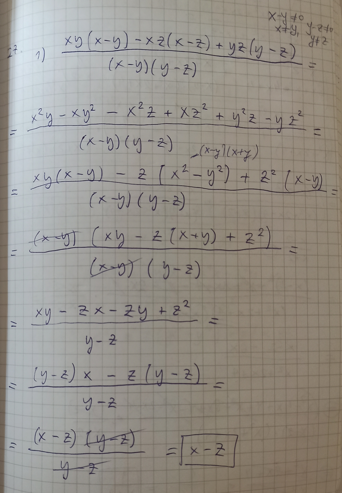
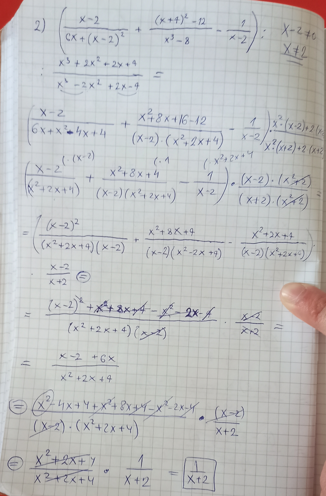

27.   Упростити:

$1^{\circ} \  \displaystyle \frac{xy(x-y) - xz(x-z)+ yz(y-z)}{(x-y)(y-z)};$

$2^{\circ} \ \biggl( \displaystyle \frac{x-2}{6x+(x-2)^2}+\frac{(x+4)^2-12}{x^3-8}-\frac{1}{x-2} \biggr):\frac{x^3+2x^2+2x+4}{x^3-2x^2+2x-4}$

Решење.

 
 