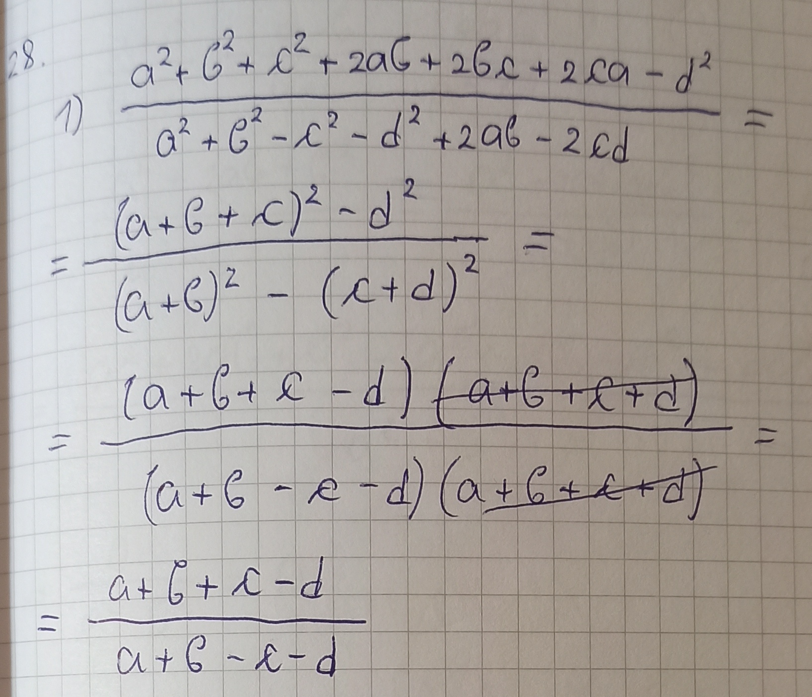

$28.$ Скрати разломке:

$1^\circ \ \displaystyle \frac{a^2 + b^2 + c^2 + 2ab + 2bc +2ca - d^2}{a^2 + b^2 - c^2 - d^2 +2ab - 2cd};$

$2^{**} \ \displaystyle \frac{x^4(y - z) + y^4(z - x) + z^4(x - y)}{(y + z)^2 + (z + x)^2 + (x + y)^2}.$

Решење.

 