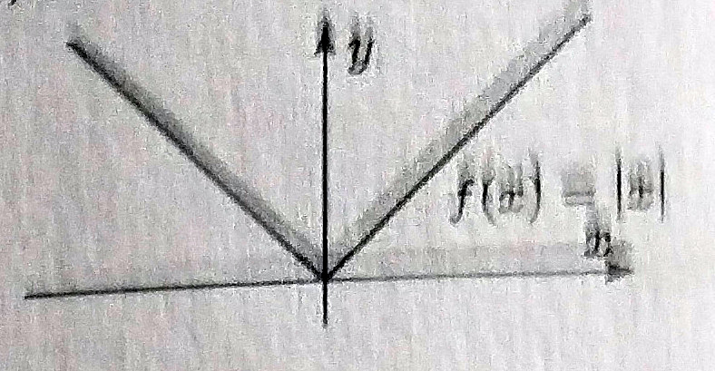
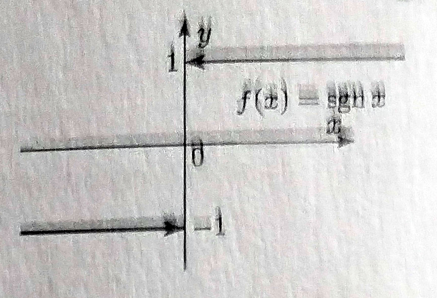
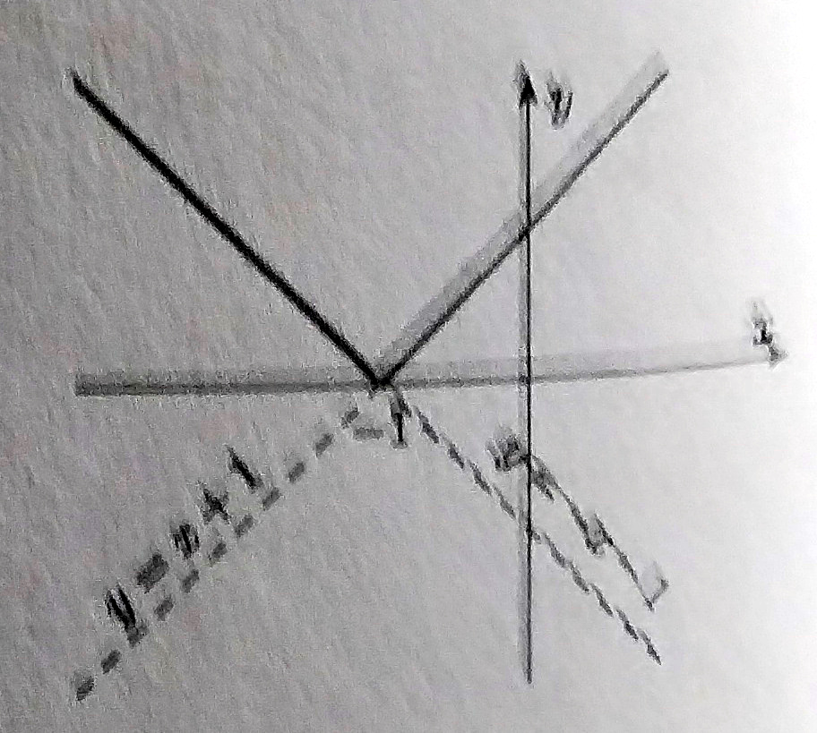
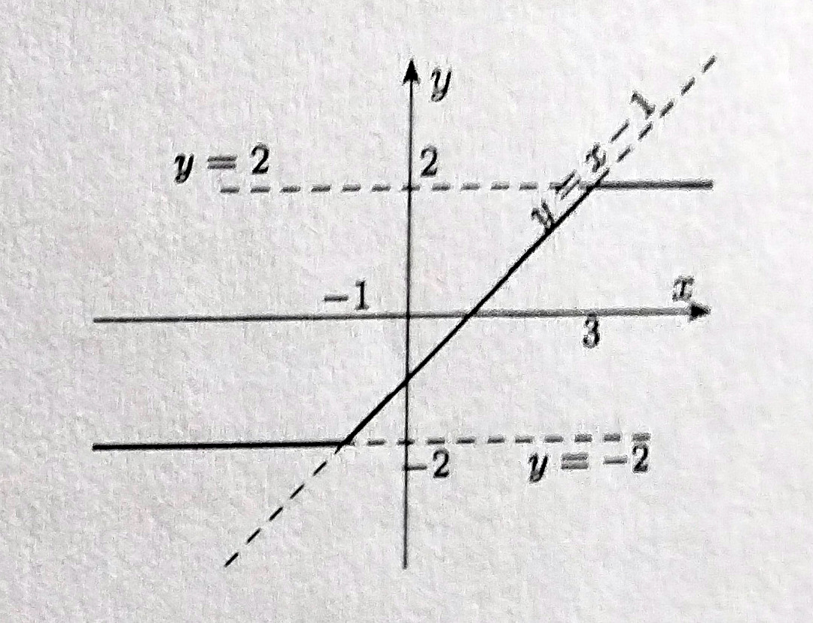
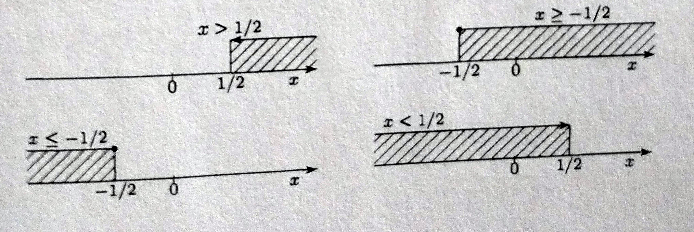
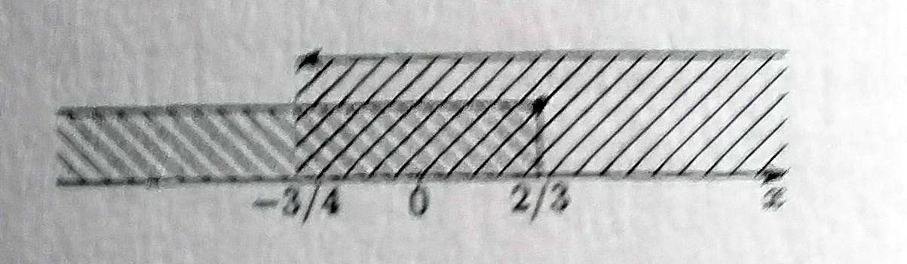

### 3. **Линеарна функција, једначине, неједначине и пропорције**

**Основни појмови.** Апцолутна вредност (модул) реалног броја $x$ јесте

 

$|x|=\left\lbrace \begin{array}{l}
\mathrm{\ \ \ x,}\ \mathrm{x\ge 0}\\
\mathrm{-x,}\ \mathrm{x\lt 0}\\
\end{array}\right.$  

Сигнум (на латинском знак) функција (знаковна функција)

$sgn \ x=\left\lbrace \begin{array}{l}
\mathrm{\ \ \ 1,}\ \mathrm{x\gt 0}\\
\mathrm{\ \ \ 0,}\ \mathrm{x= 0}\\
\mathrm{-1,}\ \mathrm{x\lt 0}\\
\end{array}\right.$

**Пример 1.**

$1.$ Нацртати графике функција

$1^{\circ} \ f(x)=|x+1|, \ 2^{\circ} \ f(x)=\displaystyle \frac{1}{2}(|x+1|-|x-3|).$

**Решење.** $1^{\circ}$ Да би нацртали график функције, треба да се избаце модули. "Критична тачка" функције је тачка за коју је израз под модуломједнак нули, тј. $x+1=0 \Leftrightarrow x=-1$

Размотримо могућности:

$i) x<-1.$ Тада је

$$x+1<0\Rightarrow|x+1|=-(x+1)=-(x+1),\ па \ је\  f(x)=-(x+1).$$

$ii) -1<x.$ Онда је

$$x+1\ge0\Rightarrow|x+1|=x+1=-(x+1),\ па \ је\  f(x)=x+1.$$

Дакле, функција је облика

$$f(x)=\left\lbrace \begin{array}{l}
\mathrm{-(x+1), \ ако\ је\ x \lt -1}\\
\mathrm{x+1, \ ако\ је\ x \ge -1.}\\
\end{array}\right.$$

График дате функције сачињавају делови правих

$y=-x-1 \ зa\ x<-1\ и\ y=x+1\ зa\ x \ge -1.$

$2^{\circ}$ Критичне тачке се одређују решавањем једначина:

$$x+1=0 \Leftrightarrow x=-1;\ x=3=0\Leftrightarrow x=3.$$

Дакле то су тачке $-1$ и $3$. Размотримо следеће могућности:

$i) x<-1.\ Тада\ је$

...

$ii) -1 \le x<3.\ Онда\ је$

...

$iii)x\ge 3.\ Онда\ је$

...

Дакле,...

Њен...

**Пример 2.** Реши неједначине по $x$:

$1^{\circ} \ -2x+1<0; \ 2^{\circ} \ -2x+1\ge0;\ 3^{\circ} \ 2x+1\ge 0;\ 4^{\circ} \ -2x+1>0.$

**Решење.** ...

имамо

...
...
...
...

Решењe...

**Пример 2.** Реши систем линеарних једначина

$$\left\lbrace \begin{array}{l}
\mathrm{-3x+2\ge 0}\\
\mathrm{4x+3\gt 0}\\
\end{array}\right.$$

**Решење.** ...

а за другу

па имамо

Графички ...

