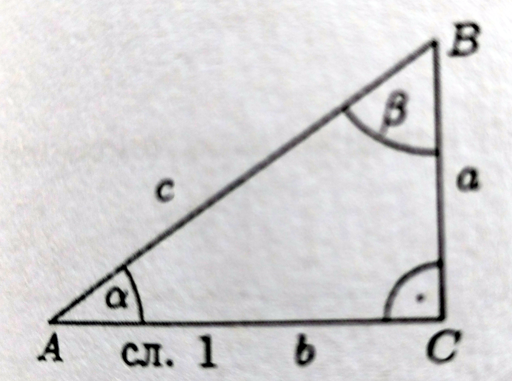

### 7.1. **Дефиниције тригинометријских функција и њихове особине**

**Дефиниције тригинометријских функција оштрог угла.** Нека је  правоугли троугао са правим углом код темена $C, \measuredangle BAC = \alpha$, $\measuredangle ABC = \beta$ и $BC = a, AC = b, AB = c.$ Тада је

$sin \alpha =\displaystyle \frac{a}{c},\ cos \alpha =\displaystyle \frac{b}{c},\ tg \alpha =\displaystyle \frac{a}{b},\ ctg \alpha =\displaystyle \frac{b}{a}.\ (1)$

Стога се често каже: Ако је $$ оштар угао неког правоуглог троугла, тада је

син а...

при чему...

функције...

**Пример 1.** ...

...

Решење.

...

**Пример 2.** ...

...

Решење.

...

**Основне релације измежу тригинометријских функција.** ...

$(2)$

Уместо...

$(3)$

Ова релација...

Пошто је...

Ако посматрамо...

$(4)$

Пошто је...

Тиме смо...

Ако углове...

Ове...

**Пример 3.** ...

...

Решење.

...

**Монотоност тригинометријских функција.** ...

Тиме смо...

$(5)$

Из...

тј

Исто

тј

**Тригинометријске функције ма којег угла.**

**Дефиниција.** ...

Апсциса

**Пример 4.** ...

...

Решење.

...