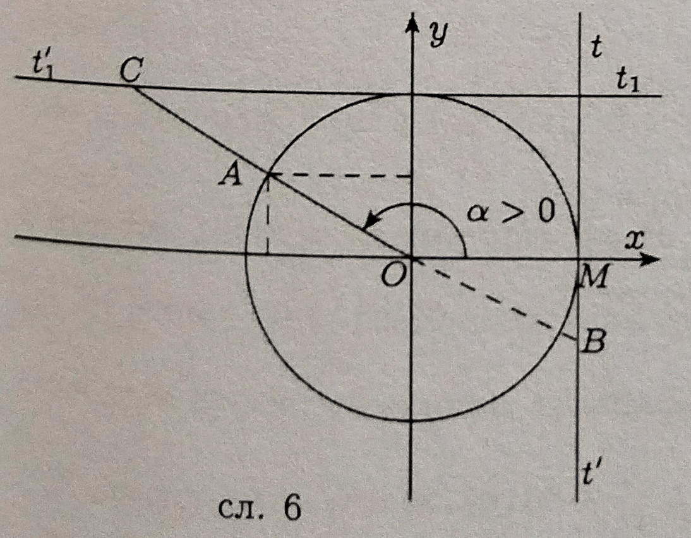

### 7.1. **Дефиниције тригинометријских функција и њихове особине**

**Дефиниције тригинометријских функција оштрог угла.** Нека је  правоугли троугао са правим углом код темена $C, \measuredangle BAC = \alpha$, $\measuredangle ABC = \beta$ и $BC = a, AC = b, AB = c.$ Тада је

$$sin\ \alpha =\displaystyle \frac{a}{c},\ cos\ \alpha =\displaystyle \frac{b}{c},\ tg\ \alpha =\displaystyle \frac{a}{b},\ ctg\ \alpha =\displaystyle \frac{b}{a}.\ (1)$$

Стога се често каже: Ако је $$ оштар угао неког правоуглог троугла, тада је

$$sin\ \alpha =\displaystyle \frac{наспрамна\ катета}{хипотенуза},\ cos\ \alpha =\displaystyle \frac{налегла\ катета}{хипотенуза},\ tg\ \alpha =\displaystyle \frac{наспрамна\ катета}{налегла\ катета},\ ctg\ \alpha =\displaystyle \frac{налегла\ катета}{наспрамна\ катета}.\ (1)$$

при чему кад кажемо катета или хипотенуза подразумевамо њихове дужине.

Функције $sin, cos, tg, ctg$ називају се *тригонометријске функције*.

**Пример 1.** Израчунати вредности тригонометријских функција оштрих углова правоуглог троугла чије су катете $24$ и $7.$

Решење. Применом Питагорине теореме, дужина хипотенузе је

$c=\sqrt{24^2+7^2}=25$

$sin\ \alpha=7/25, cos\ \alpha=24/25, tg\ \alpha=7/24, ctg\ \alpha=24/7$

$sin\ \beta=24/25, cos\ \beta=7/25, tg\ \beta=24/7, ctg\ \beta=7/24$

**Пример 2.** Израчунати вредности тригонометријских углова $30^{\circ}, 60^{\circ}\ и\ 45^{\circ}.$

Решење. Посматрајмо једнакостранични троугао $ABC$ странице $a$ (сл. 3). 

Применом Питагорине теореме за дужину висине $CD$ добијамо

$h=\sqrt{a^2-\Bigl(\displaystyle \frac{a}{2}\Bigr)^2}=\sqrt{\displaystyle \frac{3a^2}{4}}=\displaystyle \frac{a\sqrt{3}}{2}$

Из правоуглог троугла $ABC$ на основу дефиниција тригонометријских функција:

$sin\ 30^{\circ}=\displaystyle \frac{\displaystyle \frac{a}{2}}{a}=\displaystyle \frac{1}{2},\ cos\ 30^{\circ}=\displaystyle \frac{h}{a}=\displaystyle \frac{\displaystyle \frac{a \sqrt{3}}{2}}{a}=\displaystyle \frac{\sqrt{3}}{2},\ tg\ 30^{\circ}=\displaystyle \frac{\displaystyle \frac{a}{2}}{h}=\displaystyle \frac{\displaystyle \frac{a}{2}}{\displaystyle \frac{a\sqrt{3}}{2}}=\displaystyle \frac{1}{\sqrt{3}},\ ctg\ 30^{\circ}=\displaystyle \frac{h}{\displaystyle \frac{a}{2}}=\displaystyle \frac{\displaystyle \frac{a\sqrt{3}}{2}}{\displaystyle \frac{a}{2}}=\displaystyle {\sqrt{3}}$

$sin\ 60^{\circ}=\displaystyle \frac{h}{a}=\displaystyle \frac{\displaystyle \frac{a \sqrt{3}}{2}}{a}=\displaystyle \frac{\sqrt{3}}{2},\ cos\ 60^{\circ}=\displaystyle \frac{\displaystyle \frac{a}{2}}{a}=\displaystyle \frac{1}{2},\ tg\ 60^{\circ}=\displaystyle \frac{h}{\displaystyle \frac{a}{2}}=\displaystyle \frac{\displaystyle \frac{a\sqrt{3}}{2}}{\displaystyle \frac{a}{2}}=\displaystyle {\sqrt{3}},\ ctg\ 60^{\circ}=\displaystyle \frac{\displaystyle \frac{a}{2}}{h}=\displaystyle \frac{\displaystyle \frac{a}{2}}{\displaystyle \frac{a\sqrt{3}}{2}}=\displaystyle \frac{1}{\sqrt{3}}$

Нека је на сл. 4 $ABCD$ квадрат чија је страница $a$. Тада је дијагонала квадрата $d=a\sqrt{2}$ па је

$sin\ 45^{\circ}=\displaystyle \frac{a}{d}=\displaystyle \frac{a}{a\sqrt{2}}=\displaystyle \frac{1}{\sqrt{2}},cos\ 45^{\circ}=\displaystyle \frac{a}{d}=\displaystyle \frac{a}{a\sqrt{2}}=\displaystyle \frac{1}{\sqrt{2}},tg\ 45^{\circ}=ctg\ 45^{\circ}=\displaystyle \frac{a}{a}=1$

**Основне релације између тригинометријских функција.** Из ралација (1) налазимо

$(2) \ (sin\ \alpha)^2+(cos\ \alpha)^2 =\biggl( \displaystyle \frac{a}{c}\biggr)^2+\biggl( \displaystyle \frac{b}{c}\biggr)^2=\displaystyle \frac{a^2+b^2}{c}=1$ (јер је, на основу Питагорине теореме, $а^2+b^2=c^2$).

Уместо $(sin\ \alpha)^2$ пише се $sin ^2\ \alpha$, слично важи и за остале тригонометријске функције. Стога се једначина $(2)$ пише у облику

$$\ (3) sin ^2\ \alpha+cos ^2\ \alpha=1$$

Ова релација која важи за свако $\alpha$ (не само за оштар угао) позната је као *основни тригонометријски идентитет.*

Исто тако из релације (1) имамо

$tg\ \alpha=\displaystyle \frac{a}{b}=\displaystyle \frac{a/c}{b/c}=\displaystyle \frac{sin\ \alpha}{cos\ \alpha},\ ctg\ \alpha=\displaystyle \frac{b}{a}=\displaystyle \frac{b/c}{a/c}=\displaystyle \frac{cos\ \alpha}{sin\ \alpha},\ tg\ \alpha=\displaystyle \frac{1}{ctg\ \alpha}$

$$tg\ \alpha=\displaystyle \frac{sin\ \alpha}{cos\ \alpha},\ ctg\ \alpha=\displaystyle \frac{cos\ \alpha}{sin\ \alpha},\ tg\ \alpha=\displaystyle \frac{1}{ctg\ \alpha}$$

Пошто је катета увек мања од хипотенузе, на основу дефиниција тригонометријских функција оштрог угла $\alpha$ (релације (1)) тачне су неједнакости

$$0\lt\sin\ \alpha\lt1, \ 0\lt\cos\ \alpha\lt1, \ tg \ \alpha \gt0, \ ctg \ \alpha \gt0$$

па из идентитета (3) следи

$$sin \ \alpha=\sqrt{1-cos^2\ \alpha}, cos \ \alpha=\sqrt{1-sin^2\ \alpha} (\alpha\ оштар\ угао).$$

Ако посматрамо троугао $$ са сл. 1 имамо

$$(4)\ sin\ \beta=\displaystyle \frac{b}{c}, \ cos\ \beta=\displaystyle \frac{a}{c}, \ tg\ \beta=\displaystyle \frac{b}{a}, \ ctg\ \beta=\displaystyle \frac{a}{b}.$$

Пошто је $\alpha+\beta=90^{\circ} \implies \ \beta = 90^{\circ}-\alpha,$ из релација (4) и (1) следи:

$$sin(90^{\circ}-\alpha)=sin\ \beta=\displaystyle \frac{b}{c}=cos\ \alpha$$

$$cos(90^{\circ}-\alpha)=cos\ \beta=\displaystyle \frac{a}{c}=sin\ \alpha$$

$$tg(90^{\circ}-\alpha)=tg\ \beta=\displaystyle \frac{b}{a}=ctg\ \alpha$$

$$ctg(90^{\circ}-\alpha)=ctg\ \beta=\displaystyle \frac{a}{b}=tg\ \alpha$$

Тиме смо доказали формуле:

$sin(90^{\circ}-\alpha)=cos\ \alpha;\ cos(90^{\circ}-\alpha)=sin\ \alpha;\ tg(90^{\circ}-\alpha)=ctg\ \alpha;\ ctg(90^{\circ}-\alpha)=tg\ \alpha.$

Ако углове меримо радијанима, горње једнакости можемо написати:

$sin(\displaystyle \frac{\pi}{2}-\alpha)=cos\ \alpha;\ cos(\displaystyle \frac{\pi}{2}-\alpha)=sin\ \alpha;\ tg(\displaystyle \frac{\pi}{2}-\alpha)=ctg\ \alpha;\ ctg(\displaystyle \frac{\pi}{2}-\alpha)=tg\ \alpha.$

Ове формуле важе не само ако је $\alpha$ оштар угао, тј. $\alpha \in (0,\pi/2)$ већ прва и друга важе за свако $\alpha \in R$ трећа за свако $\alpha \in R, \alpha \neq\ n\pi(n\in Z)$ и четврта за свако $\alpha \in R, \alpha \neq\pi/2 +n\pi(n\in Z)$.

**Пример 3.** Израчунати $cos^2\ 37^{\circ}+cos^2\ 37^{\circ}.$

Решење. Пошто је

...

**Монотоност тригинометријских функција.** Нека је...

Тиме смо...

$(5)$

Из...

тј

Исто

тј

**Тригинометријске функције ма којег угла.**

**Дефиниција.** ...

Апсциса

**Пример 4.** Ако је...

Решење.

...

