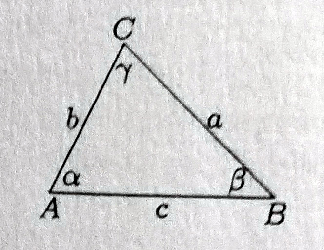

## Ознаке

$* \qquad \qquad \qquad$  Тежи или нестандардни задаци.

$!\qquad\qquad \qquad$  Задатак у којем може лако да се погреши.

$□ \qquad  \qquad  \qquad$ Крај доказа

$L\qquad\qquad \qquad$ Ознака за израз на левој страни дате једнакости у поставци задатка.

$E\qquad \qquad \qquad$ Ознака за израз у поставци задатка.

$Решење \ 8(13) \qquad$ Решење 8. задатка, поглавље 13.

$\mathbb{N}\qquad\qquad \qquad$    Скуп природних бројева.

$\mathbb{Q}\qquad\qquad \qquad$    Скуп рационалних бројева.

$\mathbb{Z}\qquad\qquad \qquad$ Скуп целих бројева.

$\mathbb{R}\qquad\qquad \qquad$  Скуп реалних бројева.

$\mathbb{C}\qquad\qquad \qquad$  Скуп комплексних бројева.

$\varnothing\qquad\qquad \qquad$  Празан скуп.

$(a,b)\qquad\qquad \qquad$  Интервал (отворен), скуп $\{x \in \mathbb{R} : a < x < b \}.$

$[a,b]\qquad\qquad \qquad$  Сегмент (затворен), скуп $\{x \in \mathbb{R} : a \le x \le b \}$, где је $0<b-a<+ \infty.$

$[a,b)\qquad \qquad \qquad$ Полузатворен (полуотворен) интервал, скуп $\{x \in \mathbb{R} : a \le x < b \}.$

$(a,b]\qquad \qquad \qquad$ Полузатворен (полуотворен) интервал, скуп $\{x \in \mathbb{R} : a < x \le b \}.$

$x \rightarrow f(x)$ Ознака за функцију која $x$ пресликава у $f(x)$, на пример функција $x \rightarrow tg(x)$ је ознака за функцију $f(x) = tg \ x$. 

$\pi (A,B,C)\qquad \qquad \qquad$ Раван одређена тачкама $A,B,C$

$\displaystyle \sum_{k = 1}^{n} a_k  = a_1+a_2+\dots+a_n$

$P(A,B,C), \ P(A,B,C,D) \qquad$ Ознака за површину троугла ABC, четвороугла ABCD. 

За троугао на слици кажемо да је са стандардним ознакама

$R \qquad  \qquad  \qquad$ Дужина полупречника описаног круга око троугла.

$r \qquad  \qquad  \qquad$ Дужина полупречника уписаног круга у троуглу.

$h_a, t_a, s_a \qquad$ Дужине висине, тежишне дужи и симетрале унутрашњег угла који одговарају страници а, односно унутрашњем углу наспрам странице дужине а.

$(a_n)_{n \in \mathbb{N}} \qquad  \qquad$ ознака за низ $(а_1, а_2, \dots, а_n \dots)$.

