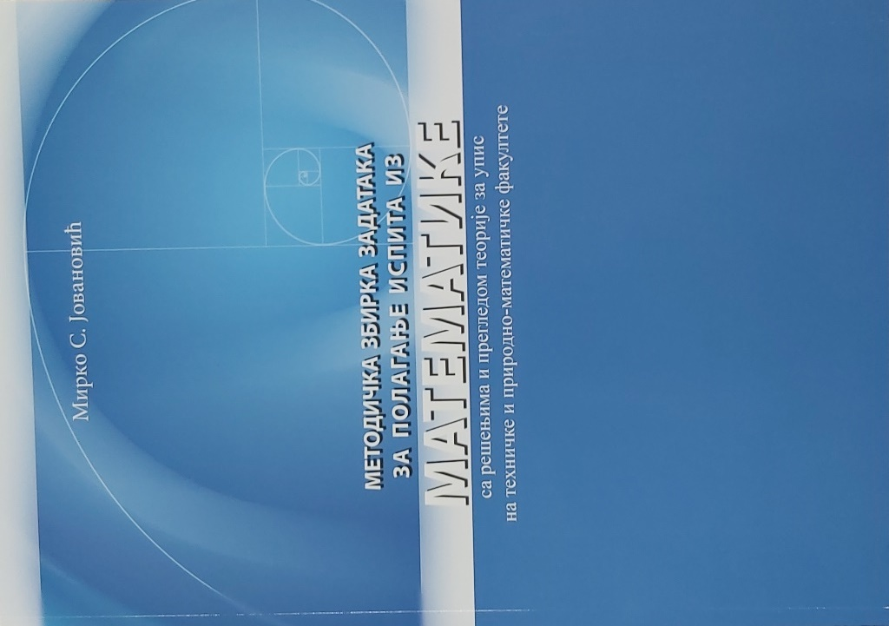

## Методичка збирка задатака за полагање пријемног испита из математике са решењима и прегледом теорије; за упис на техничке и природно-математичке факултете, 6. издање

Аутор: Мирко Јовановић
Страна: 428

На Електротехничком факултету у Београду, почев од јесени 2000. године, организује се Припремна настава за полагање пријемног испита на техничким и природно-математичким факултетима. Аутор ове збирке, заједно са осталим колегама, држи припремну наставу од самог почетка њеног организовања. Као резултат тог рада аутора настала је ова збирка.

Збирка је пре свега намењена ученицима средњих школа који се припремају за полагање пријемних испита на горе поменутим факултетима, за полагање матурског испита, као и ученицима средњих школа за савладавање градива из области обрађених у збирци. С обзиром на то да збирка садржи известан број тежих задатака, може бити од користи и ученицима који се припремају за математичка такмичења.

### САДРЖАЈ

#### ЗАДАЦИ

1. [Алгебарски изрази](link_address), 7

2. Степеновање и кореновање, 11

3. Линеарна функција, једначине, неједначине и пропорције, 16

4. Квадратна једначина, квадратна функција, квадратне неједначине, ирационалне једначине и неједначине, системи квадратних једначина, 23

5. Експоненцијална функција, једначине и неједначине, 44

6. Логаритам, 48

7. Тригонометрија, 61

8. Комплексни бројеви, 95

9. Полиноми, 100

10. Аритметичка и геометријска прогресија, 106

11. Аналитичка геометрија, 112

12. Комбинаторика, 124

13. Планиметрија, 136

14. Стереометрија, 144

15. Опште особине функције. Извод функције, 151

16. Разни задаци, 160

#### РЕШЕЊА, УПУТСТВА И КОМЕНТАРИ

Алгебарски изрази, 172

Степеновање и кореновање, 179

Линеарна функција, једначине, неједначине и пропорције, 184

Квадратна једначина, квадратна функција, квадратне неједначине, ирационалне једначине и неједначине, системи квадратних једначина, 191

Експоненцијална функција, једначине и неједначине, 215

Логаритам, 219

Тригонометрија, 235

Комплексни бројеви, 291

Полиноми, 300

Аритметичка и геометријска прогресија, 305

Аналитичка геометрија, 313

Комбинаторика, 330

Планиметрија, 338

Стереометрија, 354

Опште особине функције. Извод функције, 376

Разни задаци, 394

ЛИТЕРАТУРА, 427

#### ПРИЛОЗИ

Најпродуктивнији математичари, 43

Први тест из средњошколске математике, 60

Најпознатија математичка теорема, 94

Други тест из средњошколске математике, 105

О називима страница правоугллог троугла, 123

Члан Француске академија у 18. години, 135

Напамет до 100.000. децимале броја Пи, 135

Један доказ адиционих формула, 150

Трећи тест из средњошколске математике, 159

Њутн о свом раду, 167

Часовник Лазара Хиландарца, 337

О радијану и стерадијану, 375

Задатак са пријемног испита на Московском државном универзитету, 393

Решења тестова, 414

Детаљни подаци о књизи
Наслов: Методичка збирка задатака за полагање пријемног испита из математике са решењима и прегледом теорије; за упис на техничке и природно-математичке факултете, 6. издање
Издавач: Akademska misao
Страна: 428 (cb)
Povez: meki
Писмо: ћирилица
Формат: 21,0 x 29,7 cm
Година издања: 2021
ИСБН: 978-86-7466-883-2

